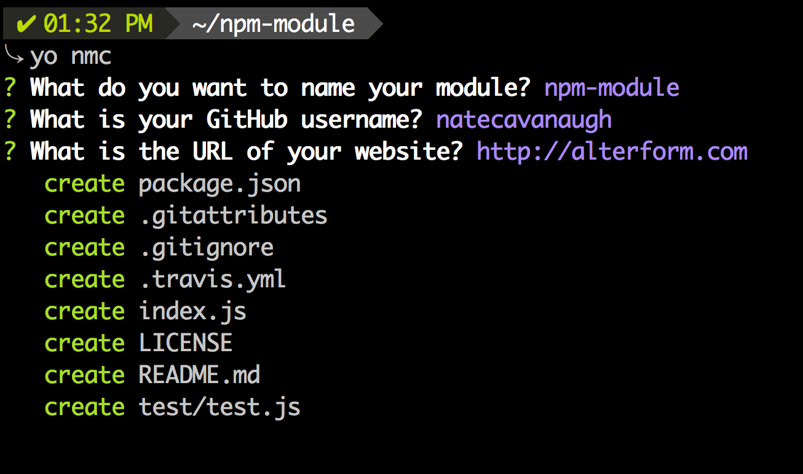

# generator-nmc [](https://travis-ci.org/natecavanaugh/generator-nmc)

> Scaffold out a node module.

This is what I use for [my own modules](https://www.npmjs.com/~natecavanaugh).

Forked from [Sindre Sorhus](http://github.com/sindresorhus/generator-nm), as while I really like the simplicity of his, I didn't want to create the .editorconfig or .jshintrc files. As time goes on, I may tweak some small things even more to my preferences.
Also nmc works either Node Module Creator, or my initials :)




## Install

```
$ npm install --global generator-nmc
```


## Usage

With [yo](https://github.com/yeoman/yo):

```
$ yo nmc
```


## License

MIT © [Sindre Sorhus](http://sindresorhus.com) (I'm going to leave the copyright in place until there's something signficant enough to add :)).